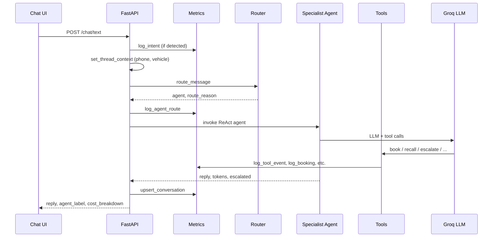

# Architecture Document

**System:** Al Futtaim Automotive Concierge (800-AF)  
**Version:** 1.0  
**Pattern:** Multi-agent orchestration with shared tool layer and unified metrics

---

## 1. High-level architecture

```
┌─────────────────────────────────────────────────────────────────┐
│                         Client (Browser)                         │
│  static/index.html  — text chat, voice, guided wizards, theme    │
│  static/admin.html  — ops dashboard                              │
└────────────────────────────┬────────────────────────────────────┘
                             │ HTTP
                             ▼
┌─────────────────────────────────────────────────────────────────┐
│                    FastAPI (main.py)                             │
│  /chat/text   /chat/voice   /metrics   /admin/*   /feedback     │
└────────────────────────────┬────────────────────────────────────┘
                             │
         ┌───────────────────┼───────────────────┐
         ▼                   ▼                   ▼
┌─────────────────┐ ┌───────────────┐ ┌─────────────────┐
│  Voice pipeline │ │ Agent core    │ │ Metrics store   │
│  Whisper STT    │ │ graph.py      │ │ metrics/store.py│
│  Orpheus TTS    │ │ router.py     │ │ SQLite          │
└─────────────────┘ └───────┬───────┘ └─────────────────┘
                            │
                            ▼
                   ┌─────────────────┐
                   │  Groq API       │
                   │  gpt-oss-120b   │
                   └─────────────────┘
```

**Design principle:** One agent brain, two channels. Text and voice share `_run_turn()` → `run_agent()` → same routing, tools, and metrics.

---

## 2. Request lifecycle (text)



---

## 3. Multi-agent orchestration

### 3.1 Specialist agents

| Agent | LangGraph entity | Tools |
|-------|------------------|-------|
| **Service** | `create_react_agent` + SERVICE_PROMPT | availability, book, profile, centres, escalate |
| **Sales** | `create_react_agent` + SALES_PROMPT | trade-in, test drive, profile, escalate |
| **Recall** | `create_react_agent` + RECALL_PROMPT | recall lookup, profile, escalate |
| **Handover** | `create_react_agent` + HANDOVER_PROMPT | escalate only |
| **General** | `create_react_agent` + GENERAL_PROMPT | profile, centres, escalate |

Each specialist is a **ReAct agent** (LangGraph prebuilt) with:

- Dedicated system prompt (`agent/prompts.py`)
- Tool subset (`agent/tools.py`)
- Shared `MemorySaver` checkpointer (per `thread_id`)
- Message trimming pre-hook (max ~4000 tokens)

### 3.2 Router (`agent/router.py`)

Routing order:

1. **Keyword match** — handover > recall > sales > service (priority order)
2. **Sticky follow-up** — short replies (≤5 words, year, time) → last agent
3. **LLM classifier** — `ROUTER_PROMPT`, single-token agent name
4. **Sticky last agent** — fallback if LLM fails
5. **Default** — `general`

Every route is persisted to `agent_routes` with `route_reason` for audit.

### 3.3 Context (`agent/context.py`)

Per-thread runtime context (in-memory):

- `customer_phone`
- `vehicle` (parsed from message or profile)
- `routed_agent`
- `variant` (A/B)

Used by tools (e.g. `book_appointment` vehicle fallback, handover package).

---

## 4. Voice architecture

```
User holds mic → MediaRecorder (webm) → POST /chat/voice
    → Groq Whisper (STT) → transcript
    → _run_turn (same as text)
    → reply text
    → Orpheus TTS (or SKIP_TTS → browser speechSynthesis)
    → audio_base64 or use_browser_tts flag
```

Cost tracking adds STT duration and TTS character costs to `cost_breakdown`.

---

## 5. Guided journeys (UI)

The chat UI (`static/index.html`) implements client-side wizards independent of the backend:

| Flow | Steps |
|------|-------|
| **Booking** | service → make → model → year → date → time → name → confirm |
| **Recall** | make → model → year → confirm |
| **Trade-in** | make → model → year → mileage band → condition → confirm |

On confirm, a single structured message is sent with `entry_mode: "guided"`.

**Thread-guided follow-up:** When the assistant reply includes `OPTIONS:` chips, the UI mounts an inline wizard at the next missing step — advancing in-place until confirm, without per-step API calls.

---

## 6. A/B experiments

- Variant assigned deterministically from `thread_id` hash (`agent/experiments.py`)
- Variant **A**: base specialist prompts
- Variant **B**: base + brevity addendum; lower `max_tokens` (256 vs 320)
- Stored on `conversations.variant`; compared in ops dashboard

---

## 7. Data architecture

Single SQLite database (`data/alfuttaim.db`):

| Table | Purpose |
|-------|---------|
| `conversations` | Per-thread rollup: resolution, cost, agent, variant, CX |
| `agent_routes` | Routing audit log |
| `intent_events` | Funnel starts and conversions |
| `tool_events` | Tool invocation log |
| `bookings` | Confirmed appointments |
| `escalations` | Handover records + JSON |
| `feedback` | Thumbs up/down |

See [TECHNICAL.md](TECHNICAL.md) for full schema.

---

## 8. Security & deployment (demo)

| Concern | Demo implementation | Production recommendation |
|---------|---------------------|---------------------------|
| API keys | `.env` / `GROQ_API_KEY` | Secrets manager |
| Admin dashboard | Open `/admin` | Auth + VPN / SSO |
| PII | Mock customer data | Encryption, retention policy |
| CORS | Same-origin static | Explicit CORS policy |

---

## 9. Extension points

| Integration | Hook |
|-------------|------|
| DMS booking | Replace `book_appointment` body in `tools.py` |
| OEM recall | Replace `RECALL_DATA` dict with API client |
| CRM escalation | Webhook in `log_escalation` after package build |
| Analytics | Stream `tool_events` / `intent_events` to warehouse |
| New specialist | Add prompt + tools + router keywords + `graph.py` registry |

---

## 10. Technology stack

| Layer | Technology |
|-------|------------|
| Runtime | Python 3.11, uv |
| API | FastAPI, Uvicorn |
| Agent framework | LangGraph, LangChain Groq |
| LLM | `openai/gpt-oss-120b` (Groq) |
| STT | `whisper-large-v3-turbo` |
| TTS | `canopylabs/orpheus-v1-english` |
| Persistence | SQLite |
| Frontend | Static HTML/CSS/JS |

---

## 11. Related documents

- [PRD.md](PRD.md) — product requirements  
- [TECHNICAL.md](TECHNICAL.md) — API reference  
- [PROMPTS.md](PROMPTS.md) — prompt design  
- [METRICS.md](METRICS.md) — KPI definitions
